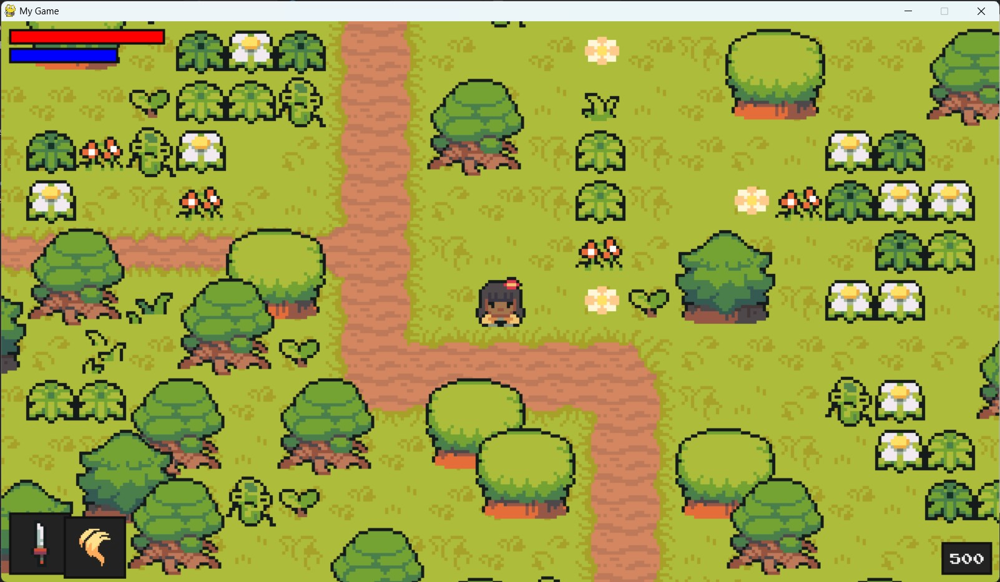

# A Basic Python Game
<!-- Sección portada del repositorio -->
<a href="#">
    
</a>

## To play directly from the Python script

Install libraries: 

```bash
pip install pygame==2.5.2
```

Enter to the **code** folder:

```bash
cd ./code
```

And execute:

```bash
python main.py
```

## Create a .exe file

Install libraries: 

```bash
pip install pyinstaller==6.8.0
```

Build a package of one file and hide cmd when executing from .exe:

```bash
pyinstaller ./code/main.py --onefile --noconsole
```

If present some problems, try with:

```bash
pyinstaller --onefile --log-level=DEBUG ./code/main.py
```

You should find the .exe file at **dist** folder